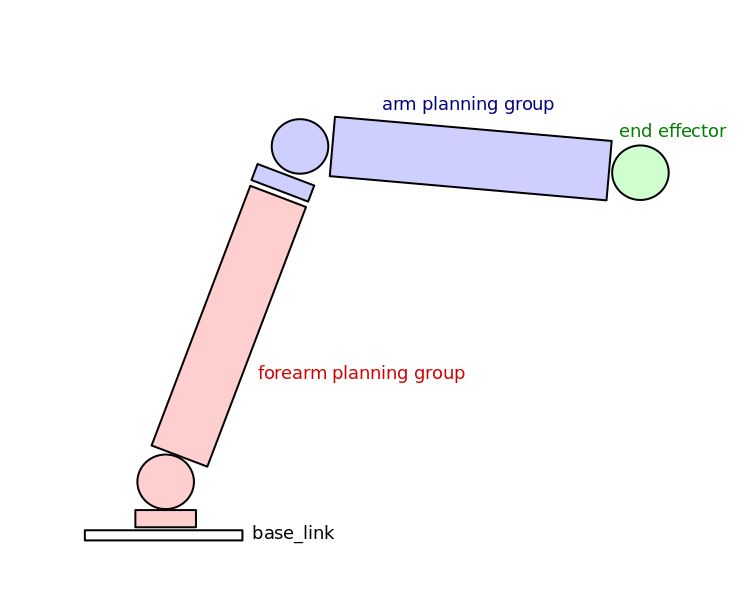

# ros-robotic-arm

This package is meant to help me understand how to use [MoveIt!](https://moveit.ros.org/) to control a robotic arm inside Gazebo. 

## Prerequsities

To use this package you need to instal 
- [ROS](http://www.ros.org/) 
- [Gazebo](http://gazebosim.org/) and 
- [MoveIt!](https://moveit.ros.org/) framework. 

## Robotic arm description

This package contains a simple robotic arm consisting of two arms and a end effector link as can be seen on the scheme bellow. 

schema of the final robotic arm

## Current State
You can start the robotic arm in Gazebo using command.

     roslaunch robotic_arm_gazebo empty_world.launch 
  
You can run rviz and see planned trajectories between different positions of the robotic arm using command

     roslaunch robotic_arm_moveit_config moveit_planning_execution.launch

and adding the MotionPlanning display to the rviz inside the GUI.

You can set the starting and end positions and then click the 'plan and execute button' and the robotic arm will move to the end position both in Rviz and in the Gazebo.
