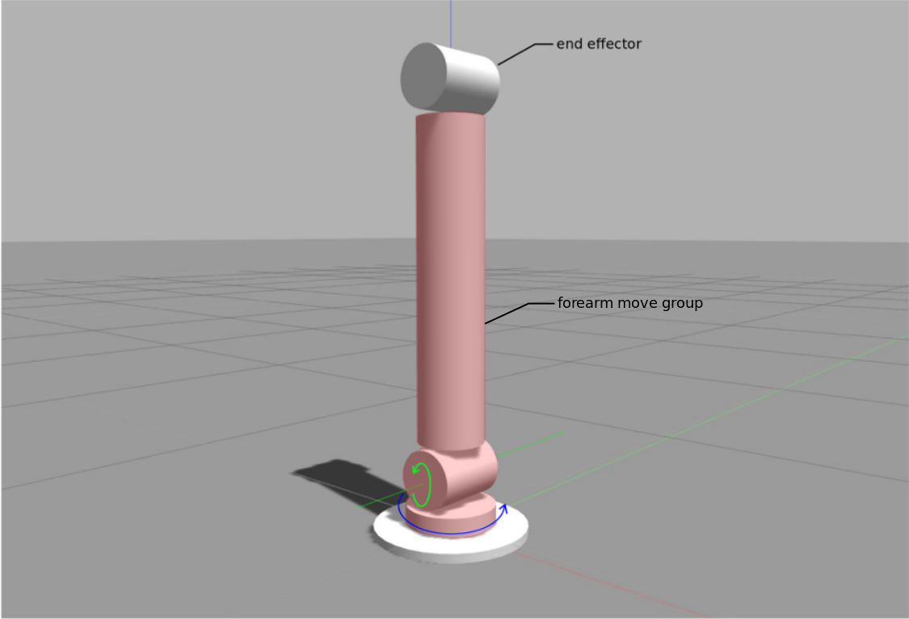

# ros-robotic-arm

This package is meant to help me understand how to use [MoveIt!](https://moveit.ros.org/) to control a robotic arm inside Gazebo. See the [respective gazebo answers question](http://answers.gazebosim.org/question/22353/how-to-connect-the-moveit-planning-with-gazebo-simulation/) for more details.

## Prerequsities

To use this package you need to instal 
- [ROS](http://www.ros.org/) 
- [Gazebo](http://gazebosim.org/) and 
- [MoveIt!](https://moveit.ros.org/) framework. 

## Robotic arm description

This package contains a simple robotic arm consisting of just 2 movable joints. So basically the robot has only a forearm 
right now and the 'end effector' is now the elbow. Once I am able to control this simplistic robotic arm, I will add the 
next link and see if I understand the MoveIt! enough, that I am able to make it work with the two arm robot.

robotic arm right now

schema of the final robotic arm

## Current State
You can start the robotic arm in Gazebo using command.

     roslaunch robotic_arm_gazebo empty_world.launch 
  
You can run rviz and see planned trajectories between different positions of the robotic arm using command

     roslaunch robotic_arm_moveit_config moveit_planning_execution.launch

and adding the MotionPlanning display to the rviz inside the GUI.

However the planned trajectories can not be executed and it is unclear whether the Gazebo has any connection with the rviz.
